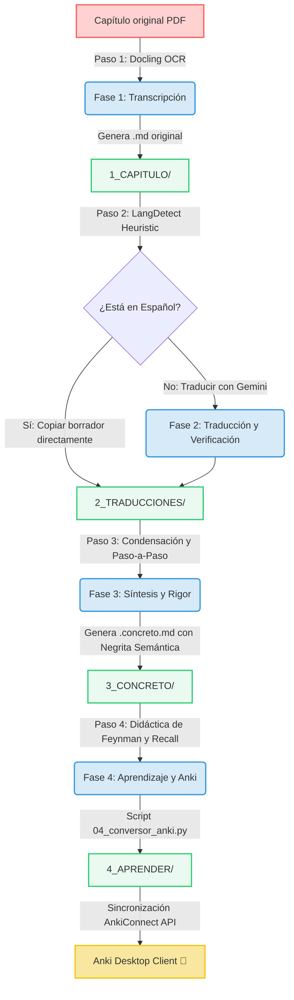

# 🧠 SciDoc Pipeline: Transcripción, Traducción y Aprendizaje de Libros Científicos

  
  
  
  
  

---

## 🎯 Objetivo del Proyecto

**SciDoc** es un pipeline automatizado y diseñado localmente para transformar capítulos de libros científicos complejos (física, química, biología, matemáticas, etc.) en recursos de aprendizaje de alto rendimiento. El objetivo principal es **eliminar la fricción entre la lectura técnica en inglés y la asimilación conceptual duradera**, automatizando la transcripción, traducción científica formal, simplificación matemática y la inyección directa de fichas de estudio a **Anki** con soporte LaTeX/MathJax integrado.

---

## 🌀 El Flujo del Pipeline (Arquitectura)

El sistema opera a través de un pipeline modular de 4 fases que procesa el contenido de forma secuencial y estructurada:

---

## ✨ Características Principales

| Característica | Descripción | Beneficio |
| :--- | :--- | :--- |
| **OCR Científico Nativo** | Integración con **IBM Docling** para extraer texto estructurado, tablas e imágenes de PDFs. | Respeta ecuaciones y no rompe el flujo lector. |
| **Filtro de Idioma Inteligente** | Algoritmo heurístico local que detecta si el documento original ya está en español. | Evita llamadas de API innecesarias y ahorra tiempo. |
| **Deducciones Paso a Paso** | Expande de manera automática las deducciones matemáticas incompletas agregando notas explicativas `[!NOTE]`. | Entendimiento completo del origen físico-matemático de cada ecuación. |
| **Directo a Anki (1-Click Sync)** | Integración nativa con la API de **AnkiConnect** para crear mazos, submazos y tarjetas automáticamente. | Cero importaciones manuales molestas de archivos CSV. |
| **MathJax Nativo en Anki** | Convierte ecuaciones de sintaxis Markdown estándar a delimitadores compatibles con Anki (`\(` y `\[`). | Visualización científica limpia y elegante de LaTeX en tus dispositivos de estudio. |

---

## 🚀 Configuración y Uso con Asistentes de IA (AI Agents)

Este repositorio está optimizado para una arquitectura **Agent-First**. No necesitas crear entornos virtuales de Python manualmente, ni realizar instalaciones o configuraciones complejas. Tu asistente de codificación favorito (**Antigravity CLI**, **OpenCode**, o **Claude Code**) se encargará de todo el trabajo técnico.

---

## 🛠️ Paso 1: Configuración Inicial (Vía tu Agente)

Abre la terminal en la carpeta de este proyecto, inicializa tu asistente de IA de preferencia y pídele lo siguiente:

> 🤖 **Prompt para el Agente**:  
> *"Instala los requerimientos de requirements.txt, asegúrate de que Python esté disponible y valida que mi API key de Gemini esté correctamente configurada desde el entorno local."*

El agente se encargará de validar tu versión de Python, instalar las dependencias requeridas y confirmar que las llaves estén listas para operar.

---

## 🎴 Paso 2: Configurar Anki (Sincronización Automática)

Para que el agente pueda inyectar las fichas directamente en tu aplicación de estudio:
1. Abre tu aplicación de **Anki** en tu computadora.
2. Ve al menú superior: **Herramientas ➔ Complementos (Tools ➔ Add-ons)**.
3. Haz clic en **Obtener complementos... (Get Add-ons...)**.
4. Pega el código de **AnkiConnect**: `2055492159`
5. Reinicia Anki.

---

## 📖 Paso 3: Uso Diario y Ejecución del Pipeline (Vía tu Agente)

Para procesar tus capítulos, solo debes colocar el PDF del libro (ej. `capitulo_1.pdf`) en la carpeta `1_CAPITULO/` y delegar las fases al agente usando estos comandos en lenguaje natural:

### Fases de Ejecución:

*   **Para transcribir y estructurar el PDF**:
    > 🤖 **Prompt**: *"Ejecuta la transcripción local ejecutando `python 0_AGENTES/01_transcriptor_pdf.py --pdf 1_CAPITULO/capitulo_1.pdf` y verifica el idioma detectado."*
    *(Nota: Si el agente detecta que el PDF ya está en español, copiará el borrador directamente a `2_TRADUCCIONES/` y se omitirá la traducción).*
    
*   **Para traducir (Fase 2)**:
    *(Solo si el original está en inglés)*:
    > 🤖 **Prompt**: *"Traduce el capítulo transcrito `1_CAPITULO/capitulo_1.md` al español académico siguiendo las reglas del documento `00_ejecutor.md` y guarda el borrador. Luego, ejecuta localmente el validador `python 0_AGENTES/02_verificar_traduccion.py` para auditar la sintaxis LaTeX."*

*   **Para integrar conceptos y explicaciones**:
    > 🤖 **Prompt**: *"Lee las instrucciones del agente en `0_AGENTES/02_integrador_conceptos.md` y aplícalas sobre el borrador traducido para generar el archivo final `2_TRADUCCIONES/capitulo_1.es.md` con las explicaciones en cursiva."*

*   **Para sintetizar el contenido (Fase 3)**:
    > 🤖 **Prompt**: *"Lee las instrucciones de `0_AGENTES/03_pipeline_concreto.md` y aplícalas sobre `2_TRADUCCIONES/capitulo_1.es.md` para generar el resumen riguroso en `3_CONCRETO/capitulo_1.concreto.md`."*

*   **Para generar fichas de Anki**:
    > 🤖 **Prompt**: *"Lee las instrucciones de `0_AGENTES/04_generador_fichas.md` y aplícalas para generar el plan de aprendizaje y autoevaluación activa en `4_APRENDER/capitulo_1.es.aprender.md`. Luego, asegúrate de que mi aplicación Anki esté abierta y ejecuta localmente el script `python 0_AGENTES/04_conversor_anki.py` para importarlas directamente al mazo SciDoc."*

*   **Para crear el tutorial interactivo de Google Colab**:
    > 🤖 **Prompt**: *"Lee las instrucciones de `0_AGENTES/05_generador_colab.md` y aplícalas sobre `3_CONCRETO/capitulo_1.concreto.md` para generar la libreta interactiva de Jupyter en `5_COLAB/capitulo_1_tutorial.ipynb`."*

---

## 📂 Estructura del Repositorio

*   📁 **`0_AGENTES/`**: Contiene los agentes (definidos en Markdown `.md`) y los scripts locales de verificación/conversión:
    *   `01_transcriptor_pdf.py` (Script local: Transcripción inicial).
    *   `02_verificar_traduccion.py` (Script local: Auditoría de sintaxis y LaTeX).
    *   `02_integrador_conceptos.md` (Agente de IA: Instrucciones de conceptos).
    *   `03_pipeline_concreto.md` (Agente de IA: Instrucciones de síntesis).
    *   `04_generador_fichas.md` (Agente de IA: Instrucciones para generar fichas de Active Recall).
    *   `04_conversor_anki.py` (Script local: Conversión y sincronización AnkiConnect).
    *   `05_generador_colab.md` (Agente de IA: Instrucciones de creación de libretas Jupyter).
*   📁 **`1_CAPITULO/`**: PDF original y transcripción Markdown (`.md`) inicial.
*   📁 **`2_TRADUCCIONES/`**: Archivos traducidos formalmente al español científico.
*   📁 **`3_CONCRETO/`**: Versión condensada con explicaciones paso a paso de fórmulas complejas.
*   📁 **`4_APRENDER/`**: Fichas de Active Recall y memoria de mazos de Anki (`MEMORIA_ANKI/`).
*   📁 **`5_COLAB/`**: Libretas de Jupyter resultantes (`.ipynb`) para Google Colab.

