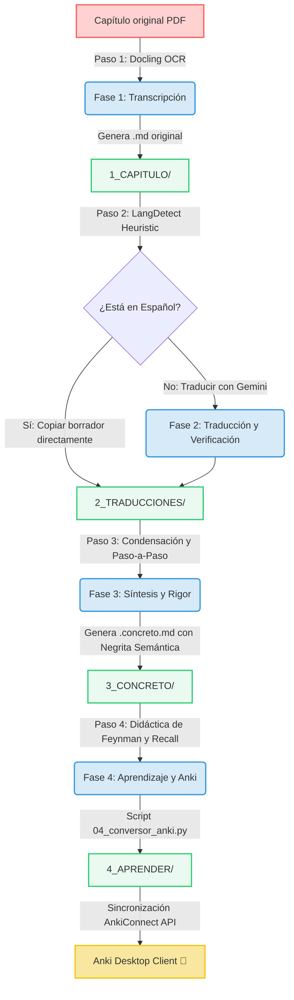

# 🧠 SciDoc Pipeline: Transcripción, Traducción y Aprendizaje de Libros Científicos

<p align="center">
  
  
  
  
  
</p>

---

## 🎯 Objetivo del Proyecto

**SciDoc** es un pipeline automatizado y diseñado localmente para transformar capítulos de libros científicos complejos (física, química, biología, matemáticas, etc.) en recursos de aprendizaje de alto rendimiento. El objetivo principal es **eliminar la fricción entre la lectura técnica en inglés y la asimilación conceptual duradera**, automatizando la transcripción, traducción científica formal, simplificación matemática y la inyección directa de fichas de estudio a **Anki** con soporte LaTeX/MathJax integrado.

---

## 🌀 El Flujo del Pipeline (Arquitectura)

El sistema opera a través de un pipeline modular de 4 fases que procesa el contenido de forma secuencial y estructurada:



---

## ✨ Características Principales

| Característica | Descripción | Beneficio |
| :--- | :--- | :--- |
| **OCR Científico Nativo** | Integración con **IBM Docling** para extraer texto estructurado, tablas e imágenes de PDFs. | Respeta ecuaciones y no rompe el flujo lector. |
| **Filtro de Idioma Inteligente** | Algoritmo heurístico local que detecta si el documento original ya está en español. | Evita llamadas de API innecesarias y ahorra tiempo. |
| **Deducciones Paso a Paso** | Expande de manera automática las deducciones matemáticas incompletas agregando notas explicativas `[!NOTE]`. | Entendimiento completo del origen físico-matemático de cada ecuación. |
| **Directo a Anki (1-Click Sync)** | Integración nativa con la API de **AnkiConnect** para crear mazos, submazos y tarjetas automáticamente. | Cero importaciones manuales molestas de archivos CSV. |
| **MathJax Nativo en Anki** | Convierte ecuaciones de sintaxis Markdown estándar a delimitadores compatibles con Anki (`\(` y `\[`). | Visualización científica limpia y elegante de LaTeX en tus dispositivos de estudio. |

---

## 🛠️ Guía de Configuración Rápida

Sigue estos pasos para poner a funcionar el proyecto en tu máquina local:

### 1. Requisitos Previos
Asegúrate de contar con **Python 3.10+** y tener instalado la aplicación de escritorio **Anki**.

### 2. Instalación del Entorno
Clona este repositorio, navega a su directorio raíz y crea un entorno virtual de Python:
```bash
python3 -m venv .venv
source .venv/bin/activate  # En macOS o Linux
# .venv\Scripts\activate   # En Windows
```
Instala todas las dependencias del proyecto:
```bash
pip install -r requirements.txt
```

### 3. Configuración de API Key (Gemini)
El proyecto utiliza los modelos de Gemini para la traducción semántica y síntesis científica. Crea un archivo `.env` en la raíz con tu clave API:
```env
GEMINI_API_KEY="Tu_Clave_API_De_Gemini_Aquí"
```

### 4. Configurar Anki (Sincronización en un Clic)
1. Abre tu aplicación de **Anki**.
2. Dirígete a **Herramientas ➔ Complementos (Tools ➔ Add-ons)**.
3. Haz clic en **Obtener complementos... (Get Add-ons...)** en la derecha.
4. Pega el código de la extensión **AnkiConnect**:
   ```text
   2055492159
   ```
5. Acepta e instala. **Reinicia Anki** para inicializar la API local.

---

## 📁 Estructura del Repositorio

*   📁 **`0_AGENTES/`**: Scripts encargados del flujo de automatización:
    *   `01_transcriptor_pdf.py` (Fase 1: Transcribe el PDF y detecta idioma).
    *   `02_verificar_traduccion.py` / `02_integrador_conceptos.py` (Fase 2: Traduce, formatea y pule vocabulario técnico).
    *   `03_pipeline_concreto.py` (Fase 3: Condensa el texto y genera deducciones paso a paso).
    *   `04_conversor_anki.py` (Fase 4: Formatea preguntas de Active Recall y las inyecta en Anki).
*   📁 **`1_CAPITULO/`**: Almacena PDFs de entrada y transcripciones estructuradas en Markdown.
*   📁 **`2_TRADUCCIONES/`**: Traducciones definitivas al español de rigor académico.
*   📁 **`3_CONCRETO/`**: Resúmenes fluidos ideales para repaso rápido sin negritas invasivas.
*   📁 **`4_APRENDER/`**: Planes de estudio individuales (`.aprender.md`) y la carpeta de persistencia de mazos `MEMORIA_ANKI/`.

---

## 📖 Instrucciones de Uso Diario

Una vez que tengas un nuevo PDF (ejemplo: `capitulo_1.pdf`), el proceso es muy sencillo:

1. Coloca el archivo en **`1_CAPITULO/`**.
2. Ejecuta la transcripción inicial:
   ```bash
   python 0_AGENTES/01_transcriptor_pdf.py --pdf 1_CAPITULO/capitulo_1.pdf
   ```
3. Si el capítulo está en inglés, ejecuta la traducción y verificación (scripts `02_*`). Si ya estaba en español, salta este paso.
4. Genera la versión resumida y explicada matemáticamente:
   ```bash
   python 0_AGENTES/03_pipeline_concreto.py 2_TRADUCCIONES/capitulo_1.es.md 3_CONCRETO/capitulo_1.concreto.md
   ```
5. Asegúrate de tener **Anki abierto** y ejecuta la inyección de tarjetas de estudio:
   ```bash
   python 0_AGENTES/04_conversor_anki.py
   ```
   *¡Tus tarjetas se organizarán automáticamente en submazos de Física y Matemáticas dentro del mazo principal **SciDoc**!*

---

## 🤖 Integración con Asistentes de Codificación IA (AI Agents)

Este repositorio ha sido diseñado bajo una arquitectura **Agent-First**. Está optimizado para que asistentes de terminal autónomos como **Antigravity CLI (Gemini)**, **OpenCode** o **Claude Code (Anthropic)** puedan leer las reglas del proyecto, ejecutar las herramientas y realizar correcciones automáticamente.

### Instrucciones para los Agentes (Prompts Sugeridos)

Puedes pedirle directamente a tu asistente de IA de preferencia que realice las tareas del pipeline. Aquí tienes algunos ejemplos:

*   **Para procesar un nuevo capítulo completo**:
    > *"Ejecuta el script de transcripción `01_transcriptor_pdf.py` para el PDF `1_CAPITULO/capitulo_2.pdf` y, si está en inglés, coordina la traducción y generación del resumen en la carpeta `3_CONCRETO/`."*
*   **Para sincronizar fichas automáticamente**:
    > *"Asegúrate de que mi aplicación Anki esté abierta y ejecuta el script `04_conversor_anki.py` para sincronizar las nuevas tarjetas."*
*   **Para corregir errores de formato**:
    > *"Lee el archivo `00_ejecutor.md` y verifica que los archivos en `2_TRADUCCIONES/` y `3_CONCRETO/` no contengan etiquetas `formula-not-decoded` ni errores de sintaxis LaTeX."*

Los agentes tienen total capacidad de ejecutar comandos locales, validar la sintaxis de las ecuaciones y resolver problemas de codificación de forma autónoma.

